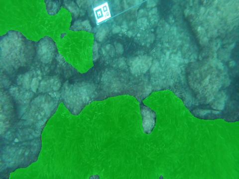
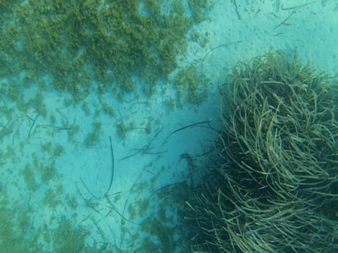
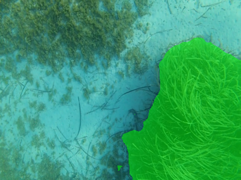

# Posidonia-semantic-segmentation

A Posidonia oceanica Semantic Segmentation model implemented in tensorflow.


 

 

Folder organization:

* preprocess: contains scripts to preprocess the images and ground thruts, resize, change extension, change color,...
* network: contains all the original network files, forked from https://github.com/MarvinTeichmann/KittiSeg.
* evaluation: contains scripts to binarize the output of the network, evaluate its performance and view the missclasified areas.
* uncertainty: contains scripts to calculate and evaluate the uncertainty areas of the network and the manual labelling process.

# Citation

https://ieeexplore.ieee.org/document/8489861

If you benefit from this code or dataset, please cite our paper:

```
@article{Miguel2018ART, 
author={M. Martin-Abadal and E. Guerrero-Font and F. Bonin-Font and Y. Gonzalez-Cid}, 
journal={IEEE Access}, 
title={Deep Semantic Segmentation in an AUV for Online Posidonia Oceanica Meadows Identification}, 
year={2018}, 
volume={6}, 
number={}, 
pages={60956-60967}, 
keywords={Semantics;Training;Image segmentation;Neural networks;Computer architecture;Decoding;Cameras;Deep learning;online semantic segmentation;Posidonia oceanica;autonomous underwater vehicle}, 
doi={10.1109/ACCESS.2018.2875412}, 
ISSN={2169-3536}, 
month={},}
```
\* If you use the network code, cite the source paper from the forked GitHub
